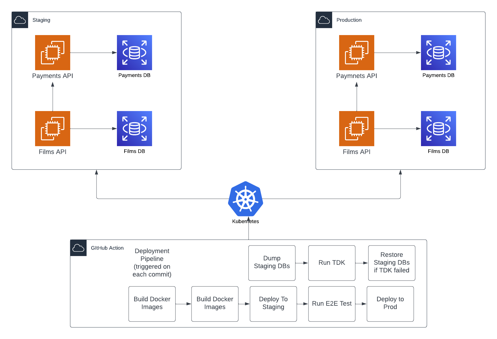

# 🚀 TDK Microservices Example

This repository is an example that shows how to use [TDK](https://docs.synthesized.io/tdk/latest/) to 
populate databases for staging environment of a simple microservice application.

## Architecture


In this example project, we use the open-source Pagila database. This database is split so that one database stores information about films and another about payments. For each database we have a corresponding service that exposes REST API to access data. This system is deployed into AWS EKS cluster into two environments: staging and production. Each environment has its own databases and services.

## Approach

- Prior to each staging deployment we refresh staging databases with the latest data from production.
- When the staging deployment finishes, we run E2E test that demonstrates that services can communicate with each other and with databases.
- If this test is successful, we promote the deployment to production.
- If this test fails, we perform the rollback of the staging deployment.

These set of steps guarantee that the deployment to staging is almost identical to the production one. For instance, if there are new database migration scripts, they would be tested on the latest replica of the production database, and the E2E tests would ensure that the new version of the application can work with the new version of the database.

## Details

- Deployments are done using Helm.
- Pipeline orchestration is done using GitHub Actions.
- TDK is deployed as a k8s job using Helm as well.
- You can see how TDK is called from Github Actions in [this file](https://github.com/synthesized-io/tdk-microservices-demo/blob/main/.github/workflows/ci-cd.yaml#L63).

## Links
- [TDK](https://docs.synthesized.io/tdk/latest/)
- [Pagila Database](https://github.com/devrimgunduz/pagila)
- [AWS EKS](https://aws.amazon.com/eks/)

## Local Development

### Init LFS
- Install Git LFS if it is not already installed, following the instructions at https://git-lfs.com/.

- From the project root directory, execute the following commands:

```bash
git lfs install
git lfs pull
```

### Start the app

```bash
docker-compose up --force-recreate --build
```

## Deploy to AWS

### Requirements

To deploy the demo you need an AWS account.

Also, make sure you have AWS CLI installed: [docs](https://docs.aws.amazon.com/cli/latest/userguide/getting-started-install.html)

### Create environments in AWS

```bash
FILMS_DB_PASSWORD=films123 PAYMENTS_DB_PASSWORD=payments123 REGION=eu-west-2  DEMO_ENV=prod ./infrastructure/scripts/create-env.sh
FILMS_DB_PASSWORD=films123 PAYMENTS_DB_PASSWORD=payments123 REGION=eu-west-2 DEMO_ENV=staging ./infrastructure/scripts/create-env.sh
```

This will deploy two envs with EKS cluster and two PostgreSQL DBs.

## Create Docker registry for both services

```bash
SERVICE_NAME=films REGION=eu-west-2 ./infrastructure/scripts/create-docker-registry.sh
SERVICE_NAME=payments REGION=eu-west-2 ./infrastructure/scripts/create-docker-registry.sh
```
Wait unit registries are created.

Now, let's build and push images to the registries

Use your AWS account ID and your AWS region in this command:

```bash
ACCOUNT=xxx REGION=eu-west-2 ./infrastructure/scripts/build-and-push.sh
```

## Deploy services

We are gonna use helm. For that we need to configure kubectl.

Let's fetch configs for our clusters:

```bash
aws eks update-kubeconfig --region eu-west-2 --name demo-eks-cluster-prod
aws eks update-kubeconfig --region eu-west-2 --name demo-eks-cluster-staging

kubectl config get-contexts
```

Copy the secret file from `infrastructure/helm/environments/staging/films-secret-staging.example.yaml` to `infrastructure/helm/environments/staging/films-secret-staging.yaml` and fill values.

Copy the secret file from `infrastructure/helm/environments/staging/payments-secret-staging.example.yaml` to `infrastructure/helm/environments/staging/payments-secret-staging.yaml` and fill values.

Copy the `NAME` of the corresponding context and run:
```bash
kubectl config use-context <STAGING NAME>
DEMO_ENV=staging ./infrastructure/scripts/install-all.sh
```

Copy the secret file from `infrastructure/helm/environments/prod/films-secret-prod.example.yaml` to `infrastructure/helm/environments/prod/films-secret-prod.yaml` and fill values.

Copy the secret file from `infrastructure/helm/environments/prod/payments-secret-prod.example.yaml` to `infrastructure/helm/environments/prod/payments-secret-prod.yaml` and fill values.

The same procedure for prod cluster:
```bash
kubectl config use-context <PROD NAME>
DEMO_ENV=prod ./infrastructure/scripts/install-all.sh
```

## Configure DNS

Get load balancer names for staging:
```bash
kubectl config use-context <STAGING NAME>
kubectl get svc -n ingress-nginx ingress-nginx-controller -o jsonpath='{.status.loadBalancer.ingress[0].hostname}'
```

and prod:
```bash
kubectl config use-context <PROD NAME>
kubectl get svc -n ingress-nginx ingress-nginx-controller -o jsonpath='{.status.loadBalancer.ingress[0].hostname}'
```

Create an A records in Route53 for this NLBs. See [docs](https://docs.aws.amazon.com/Route53/latest/DeveloperGuide/routing-to-elb-load-balancer.html):

```text
staging.tdk-microservices-demo.com -> <STAGING NLB>
tdk-microservices-demo.com -> <PROD NLB>
```

## Appendix: Pagila dump splitting:

```bash
docker run --name pagila-postgres -e POSTGRES_PASSWORD=123 -p 5432:5432 -d postgres
docker cp <pagila_dump> pagila-postgres:/tmp/pagila_dump.sql
docker exec -it pagila-postgres psql -U postgres -f /tmp/pagila_dump.sql

python3 -m pip install psycopg2 
python3 infrastructure/scripts/split.py

pg_dump -h localhost -U postgres -f "pagila_films.sql" --no-owner pagila_films
pg_dump -h localhost -U postgres -f "pagila_payments.sql" --no-owner pagila_payments
```


### Configure CI/CD

1. [Create AWS user](https://eu-west-2.console.aws.amazon.com/iamv2/home?region=eu-west-2#/users) to be used in CI/CD with the attached roles:
    * `arn:aws:iam::aws:policy/AmazonEC2ContainerRegistryFullAccess`
    * `arn:aws:iam::aws:policy/AmazonEKSClusterPolicy`
    * `arn:aws:iam::aws:policy/AmazonEKSWorkerNodePolicy`
2. Create access key for the created account
3. Fill GitHub repository secrets `AWS_ACCESS_KEY_ID`, `AWS_ACCOUNT_ID`, `AWS_SECRET_ACCESS_KEY`, `FILMS_PASSWORD`, `FILMS_USERNAME`, `PAYMENTS_PASSWORD`, `PAYMENTS_USERNAME`, `PROD_FILMS_DB_HOST`, `PROD_PAYMENTS_DB_HOST`, `STAGING_FILMS_DB_HOST`, `STAGING_PAYMENTS_DB_HOST`, `SYNTHESIZED_INVENTORY`, `SYNTHESIZED_KEY`

4. Add access to CI user for both prod and staging environments
    * Edit the configmap `aws-auth`: 
      ```bash
      kubectl edit configmap -n kube-system aws-auth
      ```
      There should be something like
      ```yaml
      apiVersion: v1
      kind: ConfigMap
      metadata:
      name: aws-auth
      namespace: kube-system
      data:
        mapRoles: |
          - rolearn: <EKSNodeRole>
            username: system:node:{{EC2PrivateDNSName}}
            groups:
              - system:bootstrappers
              - system:nodes
         ```
   * Add the CI user to the `username` key:
      ```yaml
      apiVersion: v1
      kind: ConfigMap
      metadata:
      name: aws-auth
      namespace: kube-system
      data:
        mapRoles: |
          - rolearn: <EKSNodeRole>
            username: system:node:{{EC2PrivateDNSName}}
            groups:
              - system:bootstrappers
              - system:nodes
        mapUsers: |
          - userarn: <ARN of CI account>
            username: tdk-microservices-demo
            groups:
              - system:masters

      ```


## Synthesized TDK

The synthesized TDK is used to mask data from production databases.

In this demo, [TDK](https://docs.synthesized.io/tdk/latest/) is called in the CI/CD pipeline via [Helm Chart](https://github.com/synthesized-io/tdk/pkgs/container/synthesized-tdk). You can find the [multi-database configuration](https://docs.synthesized.io/tdk/latest/user_guide/tutorial/multi_database) in `./tdk/config.yaml`.

The database credentials are configured using [inventory yaml](https://docs.synthesized.io/tdk/latest/user_guide/reference/inventory) stored in GitHub Actions Secrets.